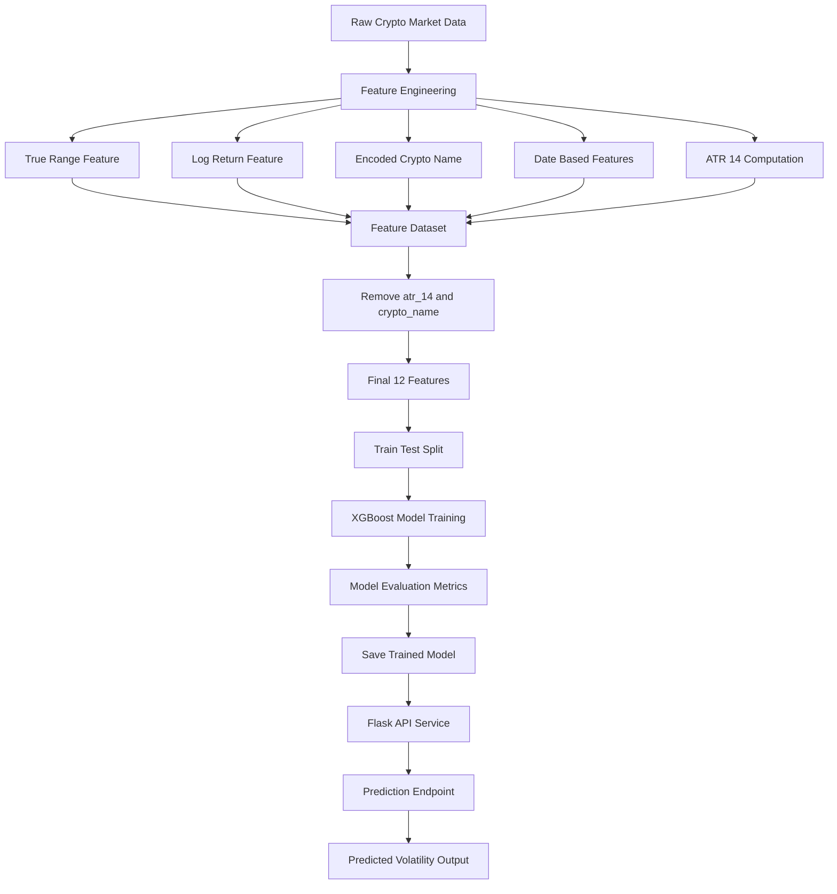

```mermaid
flowchart TD
    A[Raw Crypto Market Data] --> B[Feature Engineering]

    B --> B1[True Range Feature]
    B --> B2[Log Return Feature]
    B --> B3[Encoded Crypto Name]
    B --> B4[Date Based Features]
    B --> B5[ATR 14 Computation]

    B1 --> C[Feature Dataset]
    B2 --> C
    B3 --> C
    B4 --> C
    B5 --> C

    C --> D[Remove atr_14 and crypto_name]
    D --> E[Final 12 Features]

    E --> F[Train Test Split]
    F --> G[XGBoost Model Training]
    G --> H[Model Evaluation Metrics]

    H --> I[Save Trained Model]
    I --> J[Flask API Service]
    J --> K[Prediction Endpoint]
    K --> L[Predicted Volatility Output]

```
